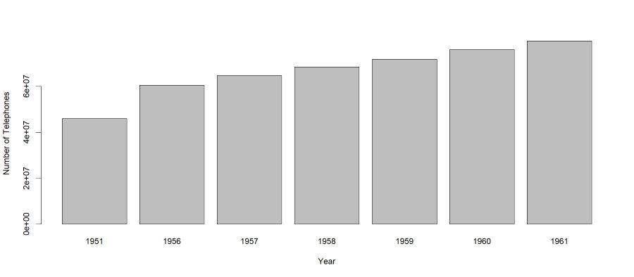

# Presenting interactive Shiny application

## User can select the region to know the Number of telephones in that region

- N.America
- S.America
- Asia 
- Africa 
etc..

--- 

# Select region to know the number of telephones

```r
library(shiny)
shinyApp(
  ui = fluidPage(
    selectInput("region", "Region:",
                choices = colnames(WorldPhones)),
    plotOutput("phonePlot")
  ),

  server = function(input, output) {
    output$phonePlot = renderPlot({
      barplot(WorldPhones[,input$region]*1000,
              ylab = "Number of Telephones", xlab = "Year")
    })
  },
  options = list(height = 500)
)
```

```
## 
## Listening on http://127.0.0.1:7216
```

```
## Warning in normalizePath(path.expand(path), winslash, mustWork):
## path[1]="webshot2e80429563a3.png": The system cannot find the file
## specified
```

```
## Warning in file(con, "rb"): cannot open file 'C:
## \Users\H138973\AppData\Local\Temp\RtmpAX4fVX\file2e803874e1\webshot2e80429563a3.png':
## No such file or directory
```

```
## Error in file(con, "rb"): cannot open the connection
```

---



---

### Shiny App is hosted at: https://cpatil.shinyapps.io/Shinyapp-Project/ 
### Presentation is created using Slidify package It is important to set right working directory to make Slidify work


# End of the App - Thank you

---
